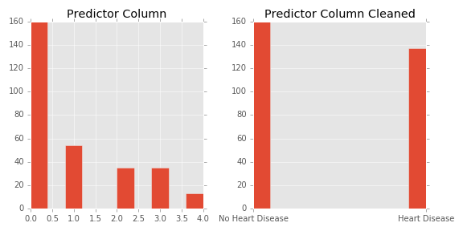
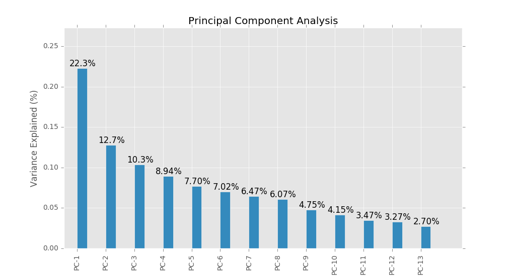
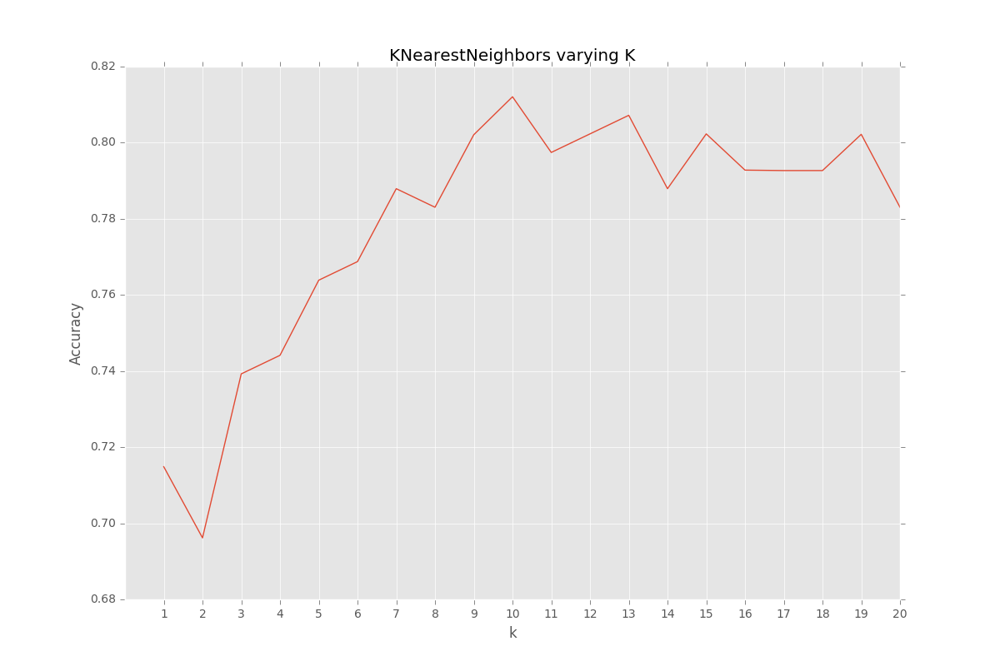

<center><h1> Predicting Heart Disease </h1> <h4>using KNearestNeighbors (KNN) classifier</h4></center>

---
In this sprint, I use a KNearestNeighbors classifier to predict the presence of heart disease in patients from the [UCI processed Cleveland dataset](https://archive.ics.uci.edu/ml/machine-learning-databases/heart-disease/processed.cleveland.data).

The baseline model with k=1 Nearest neighbor predicted at 58% test accuracy. Below I walk you through my process of improving the model to 89% test accuracy at the end of the sprint.

My main code file is [hd_knn.py](./hd_knn.py). Send questions or comments to gav.estenssoro@gmail.com.

---
# Exploratory Data Analysis (EDA)

The Jupyter (Ipython) notebook [(eda.ipynb)](./eda.ipynb) contains my code for EDA.

With some [Googling](http://archive.ics.uci.edu/ml/datasets/Heart+Disease) I first found what each column corresponded to and which column is the the predictor column ('num').

There is missing data in 2 columns. I explored saving these data rows by replacing missing data with the feature’s mode (since these were categorical features). However this made the model predict worse. I ended up dropping the rows with missing data, loosing 6 of the 303 data points.

I also plotted distributions. I cleaned the data so the data types aligned for the analysis portion.

The predictor column (‘num’) contained 5 categories (0-4) making it difficult to perform a classification. Also the distribution of the predictor column showed extreme class imbalance. I found [instructions](http://archive.ics.uci.edu/ml/datasets/Heart+Disease) that a ‘0’ value indicates no presence of heart disease while 1-4 indicates possibility of heart disease. Therefore, I mapped boolean values to this column which changed the 1-4 values to ‘1’.  _Now this became a classification problem of identifying patient as not having heart disease (0 prediction) or having the presence of heart disease (1 prediction)._ Doing this also addressed the previous class imbalance problem so I no longer needed to explore options to address this such as stratification, oversampling, or synthetic minority oversampling technique (SMOTE).

Distribution of predictor ('num') before and after mapping boolean columns.



---
# The KNearestNeighbors Algorithm

The pseudo-code for the KNN algorithm is as follows:
```
for every point in the dataset:
    calculate the distance between the point and x
    sort the distances in increasing order
    take the k items with the smallest distances to x
    return the majority class among these items
```

Scikit-Learn's suite of python packages simplifies the implementation of this project and is used extensively. Again, my main code file is [hd_knn.py](./hd_knn.py).

---
# Scale the Data

Ahhh the 'curse of dimensionality'. The core of the KNN algorithm is the distance to the nearest ‘k’ points. Each additional dimension (feature) drastically increases the distance between points thus affecting the model. In addition to that, in higher dimensions, substantially more data points are needed to have the same data density than in smaller dimensions.

A first step in combating the curse of dimensionality is scaling the data. Scaling subtracts the mean and also divides by 1 standard deviation. The distribution of each feature is now centered around zero. The step alone substantially increases the predictive accuracy of the model.

I also looked into dropping features that are loosely correlated. This however did not improve the accuracy of the model.

---
# More Dimensionality Reduction

After scaling the data I used another dimensionality reduction technique called Principal Component Analysis (PCA). PCA essentially uses linear algebra techniques to identify the components with the most predictive powers. More specifically, it identifies components with the most variance. The more variance of a predictor then the more it allows the model to separate the data.

From the chart below you see that 10 principal components account for >90% of the variance in the data. Moving forward in the model predictions, the data has been transformed to use 10 principal components.




---
# Optimize k

The hyper-parameter of KNN is k. To optimize k, I simply iterated k from 1-20 nearest neighbors and picked the k that maximized accuracy. From the chart below you can see that k=10 maximizes accuracy.



Note: The final test accuracy is 89% this graph shows the k-folds validation accuracy on the training data with 5 folds.

---
# Recommendations

 - Explore using other classifiers
KNN models tend to underperform with categorical data
    - Look into:  
Random forest  
Logistic regression  
Support vector machine  
ROC curve for selecting classifier


- Include other data from data set. There are 76 features that go along with this dataset. This sprint only used 13 and the predictor column.

- Cost benefit matrix for business analysis
  - i.e. identify costs and benefits of FP, FN, TP, TN to select model to maximize business case

- Optimize KNN distance metric in algorithm
  - Consider weighting closer neighbors higher in the algorithm
